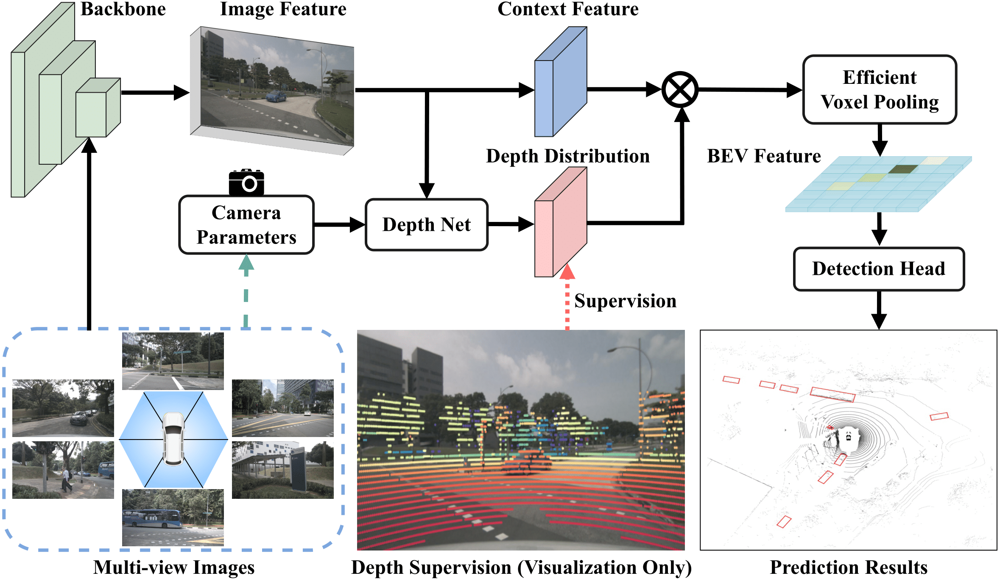
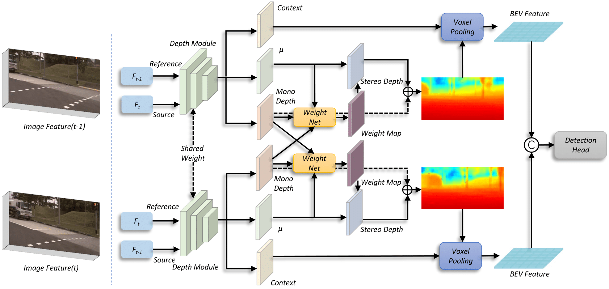
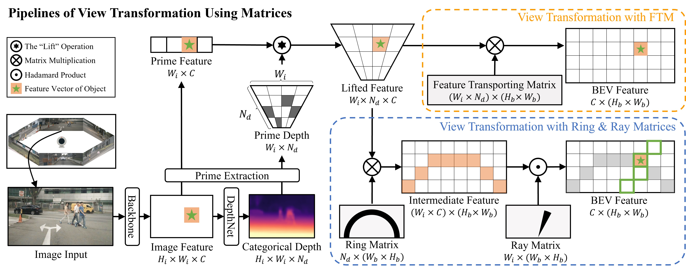

## BEVDepth
BEVDepth is a new 3D object detector with a trustworthy depth
estimation. For more details, please refer to our [paper on Arxiv](https://arxiv.org/abs/2206.10092).



## BEVStereo
BEVStereo is a new multi-view 3D object detector using temporal stereo to enhance depth estimation.


## MatrixVT
[MatrixVT](bevdepth/exps/nuscenes/MatrixVT/matrixvt_bev_depth_lss_r50_256x704_128x128_24e_ema.py) is a novel View Transformer for BEV paradigm with high efficiency and without customized operators. For more details, please refer to our [paper on Arxiv](https://arxiv.org/abs/2211.10593). Try MatrixVT on **CPU** by run [this file](bevdepth/layers/backbones/matrixvt.py) !


## Updates!!
* 【2022/12/06】 We released our new View Transformer (MatrixVT), the paper is on [Arxiv](https://arxiv.org/abs/2211.10593).
* 【2022/11/30】 We updated our paper(BEVDepth) on [Arxiv](https://arxiv.org/abs/2206.10092).
* 【2022/11/18】 Both BEVDepth and BEVStereo were accepted by AAAI'2023.
* 【2022/09/22】 We released our paper(BEVStereo) on [Arxiv](https://arxiv.org/abs/2209.10248).
* 【2022/08/24】 We submitted our result(BEVStereo) on [nuScenes Detection Task](https://nuscenes.org/object-detection?externalData=all&mapData=all&modalities=Camera) and achieved the SOTA.
* 【2022/06/23】 We submitted our result(BEVDepth) without extra data on [nuScenes Detection Task](https://nuscenes.org/object-detection?externalData=all&mapData=all&modalities=Camera) and achieved the SOTA.
* 【2022/06/21】 We released our paper(BEVDepth) on [Arxiv](https://arxiv.org/abs/2206.10092).
* 【2022/04/11】 We submitted our result(BEVDepth) on [nuScenes Detection Task](https://nuscenes.org/object-detection?externalData=all&mapData=all&modalities=Camera) and achieved the SOTA.


## Quick Start
### Installation
**Step 0.** Install [pytorch](https://pytorch.org/)(v1.9.0).

**Step 1.** Install [MMDetection3D](https://github.com/open-mmlab/mmdetection3d)(v1.0.0rc4).

**Step 2.** Install requirements.
```shell
pip install -r requirements.txt
```
**Step 3.** Install BEVDepth(gpu required).
```shell
python setup.py develop
```

### Data preparation
**Step 0.** Download nuScenes official dataset.

**Step 1.** Symlink the dataset root to `./data/`.
```
ln -s [nuscenes root] ./data/
```
The directory will be as follows.
```
BEVDepth
├── data
│   ├── nuScenes
│   │   ├── maps
│   │   ├── samples
│   │   ├── sweeps
│   │   ├── v1.0-test
|   |   ├── v1.0-trainval
```
**Step 2.** Prepare infos.
```
python scripts/gen_info.py
```

### Tutorials
**Train.**
```
python [EXP_PATH] --amp_backend native -b 8 --gpus 8
```
**Eval.**
```
python [EXP_PATH] --ckpt_path [CKPT_PATH] -e -b 8 --gpus 8
```

### Benchmark
|Exp |EMA| CBGS |mAP |mATE| mASE | mAOE |mAVE| mAAE | NDS | weights |
| ------ | :---: | :---: | :---:       |:---:     |:---:  | :---: | :----: | :----: | :----: | :----: |
|[BEVDepth](bevdepth/exps/nuscenes/mv/bev_depth_lss_r50_256x704_128x128_24e_2key.py)| | |0.3304| 0.7021| 0.2795| 0.5346| 0.5530| 0.2274| 0.4355 | [github](https://github.com/Megvii-BaseDetection/BEVDepth/releases/download/v0.0.2/bev_depth_lss_r50_256x704_128x128_24e_2key.pth)
|[BEVDepth](bevdepth/exps/nuscenes/mv/bev_depth_lss_r50_256x704_128x128_24e_2key_ema.py)|√ | |0.3329 |  0.6832     |0.2761 | 0.5446 | 0.5258 | 0.2259 | 0.4409 | [github](https://github.com/Megvii-BaseDetection/BEVDepth/releases/download/v0.0.2/bev_depth_lss_r50_256x704_128x128_24e_2key_ema.pth)
|[BEVDepth](bevdepth/exps/nuscenes/mv/bev_depth_lss_r50_256x704_128x128_20e_cbgs_2key_da.py)| |√ |0.3484| 0.6159| 0.2716| 0.4144| 0.4402| 0.1954| 0.4805 | [github](https://github.com/Megvii-BaseDetection/BEVDepth/releases/download/v0.0.2/bev_depth_lss_r50_256x704_128x128_20e_cbgs_2key_da.pth)
|[BEVDepth](bevdepth/exps/nuscenes/mv/bev_depth_lss_r50_256x704_128x128_20e_cbgs_2key_da_ema.py)|√  |√ |0.3589 |  0.6119     |0.2692 | 0.5074 | 0.4086 | 0.2009 | 0.4797 | [github](https://github.com/Megvii-BaseDetection/BEVDepth/releases/download/v0.0.2/bev_depth_lss_r50_256x704_128x128_20e_cbgs_2key_da_ema.pth) |
|[BEVStereo](bevdepth/exps/nuscenes/mv/bev_stereo_lss_r50_256x704_128x128_24e_2key.py)|  | |0.3456 | 0.6589 | 0.2774 | 0.5500 | 0.4980 | 0.2278 | 0.4516 | [github](https://github.com/Megvii-BaseDetection/BEVStereo/releases/download/v0.0.2/bev_stereo_lss_r50_256x704_128x128_24e_2key.pth) |
|[BEVStereo](bevdepth/exps/nuscenes/mv/bev_stereo_lss_r50_256x704_128x128_24e_2key_ema.py)|√  | |0.3494|	0.6671|	0.2785|	0.5606|	0.4686|	0.2295|	0.4543 | [github](https://github.com/Megvii-BaseDetection/BEVStereo/releases/download/v0.0.2/bev_stereo_lss_r50_256x704_128x128_24e_2key_ema.pth) |
|[BEVStereo](bevdepth/exps/nuscenes/mv/bev_stereo_lss_r50_256x704_128x128_24e_key4.py)|  | |0.3427|	0.6560|	0.2784|	0.5982|	0.5347|	0.2228|	0.4423 | [github](https://github.com/Megvii-BaseDetection/BEVStereo/releases/download/v0.0.2/bev_stereo_lss_r50_256x704_128x128_24e_key4.pth) |
|[BEVStereo](bevdepth/exps/nuscenes/mv/bev_stereo_lss_r50_256x704_128x128_24e_key4_ema.py)|√  | |0.3435|	0.6585|	0.2757|	0.5792|	0.5034|	0.2163|	0.4485 | [github](https://github.com/Megvii-BaseDetection/BEVStereo/releases/download/v0.0.2/bev_stereo_lss_r50_256x704_128x128_24e_key4_ema.pth) |
|[BEVStereo](bevdepth/exps/nuscenes/mv/bev_stereo_lss_r50_256x704_128x128_20e_cbgs_2key_da.py)|  |√ |0.3576|	0.6071|	0.2684|	0.4157|	0.3928|	0.2021|	0.4902 | [github](https://github.com/Megvii-BaseDetection/BEVStereo/releases/download/v0.0.2/bev_stereo_lss_r50_256x704_128x128_20e_cbgs_2key_da.pth) |
|[BEVStereo](bevdepth/exps/nuscenes/mv/bev_stereo_lss_r50_256x704_128x128_20e_cbgs_2key_da_ema.py)|√  |√ |0.3721|	0.5980|	0.2701|	0.4381|	0.3672|	0.1898|	0.4997 | [github](https://github.com/Megvii-BaseDetection/BEVStereo/releases/download/v0.0.2/bev_stereo_lss_r50_256x704_128x128_20e_cbgs_2key_da_ema.pth) |

## FAQ

### EMA
- The results are different between evaluation during training and evaluation from ckpt.

Due to the working mechanism of EMA, the model parameters saved by ckpt are different from the model parameters used in the training stage.

- EMA exps are unable to resume training from ckpt.

We used the customized EMA callback and this function is not supported for now.

## Cite BEVDepth & BEVStereo & MatrixVT
If you use BEVDepth and BEVStereo in your research, please cite our work by using the following BibTeX entry:

```latex
 @article{li2022bevdepth,
  title={BEVDepth: Acquisition of Reliable Depth for Multi-view 3D Object Detection},
  author={Li, Yinhao and Ge, Zheng and Yu, Guanyi and Yang, Jinrong and Wang, Zengran and Shi, Yukang and Sun, Jianjian and Li, Zeming},
  journal={arXiv preprint arXiv:2206.10092},
  year={2022}
}
@article{li2022bevstereo,
  title={Bevstereo: Enhancing depth estimation in multi-view 3d object detection with dynamic temporal stereo},
  author={Li, Yinhao and Bao, Han and Ge, Zheng and Yang, Jinrong and Sun, Jianjian and Li, Zeming},
  journal={arXiv preprint arXiv:2209.10248},
  year={2022}
}
@article{zhou2022matrixvt,
  title={MatrixVT: Efficient Multi-Camera to BEV Transformation for 3D Perception},
  author={Zhou, Hongyu and Ge, Zheng and Li, Zeming and Zhang, Xiangyu},
  journal={arXiv preprint arXiv:2211.10593},
  year={2022}
}
```
